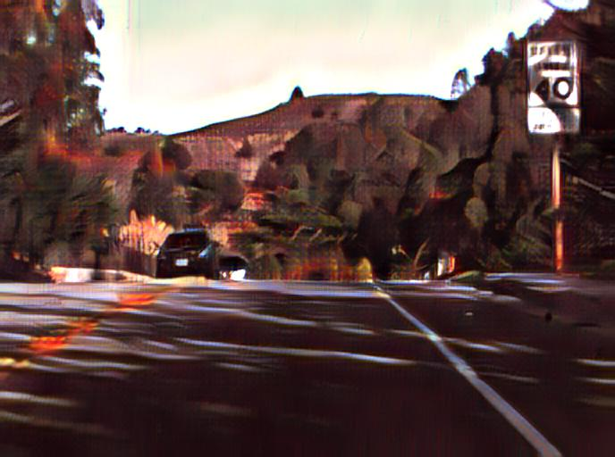
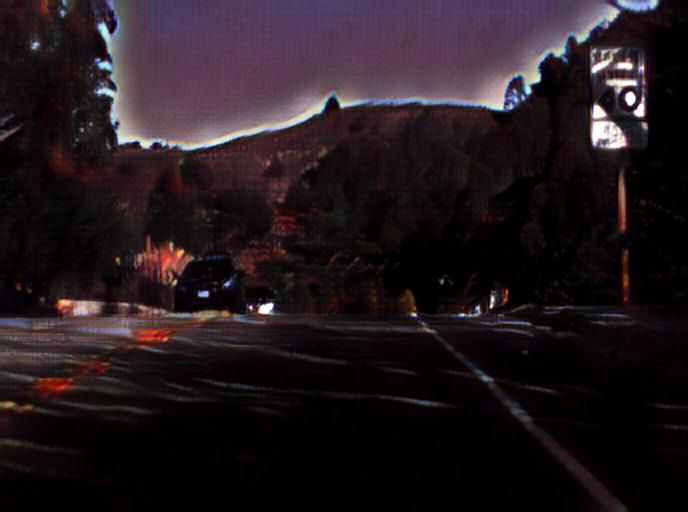
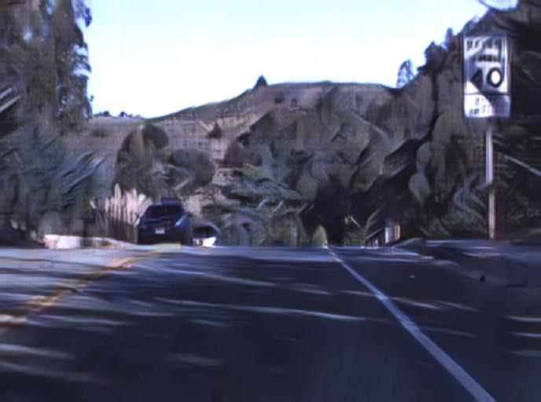

## 环境安装

- 按照torch官方文档安装，先服务器torch环境已安装完好
- 该实验cudnn版本使用的是较老的版本，而服务器安装的是最新的9.0，所以在不影响服务器全局环境变量的前提下在跑实验是需`export CUDNN_PATH="/usr/local/cuda-8.0/lib64/libcudnn.so.5"`　否则会报错，具体实验脚本命令  
`time th train.lua -contentDir $COCO_TRAIN_DIR -styleDir $WIKIART_TRAIN_DIR -contentSize 0 -styleSize 0 -reconStyle -gpu 5`

## 可优化部分

- 改实验主要由一个vgg model和一个解码器decoder组成，而github只提供了decoder的训练代码，所以用自己训练的decoder来合成新的图片output始终会有demo里面的艺术化风格，猜测是默认的vgg model导致，这点之后可以试着改变优化看能否提升效果。

## output sample

