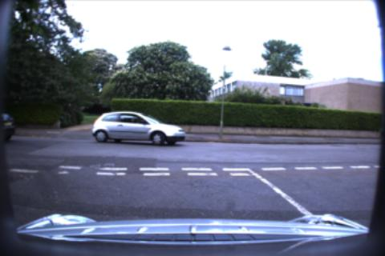
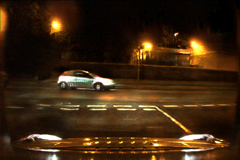
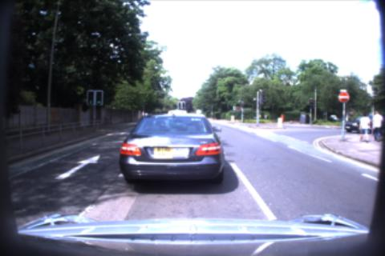
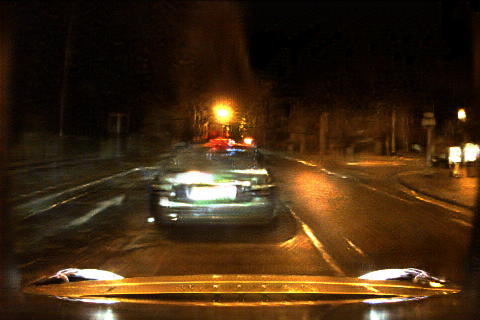
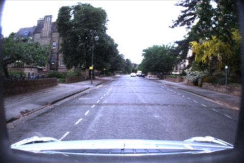
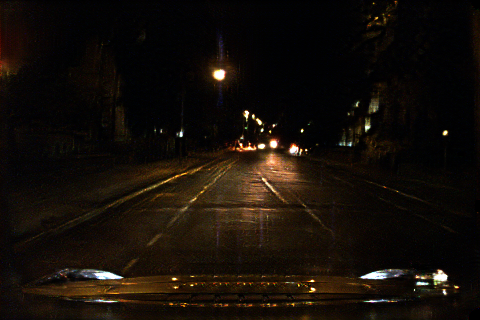

In the past a few days I ran the training code for about 10 times over the `udacity` datasetand another dataset which comes from a video of night driving under `/home/sway007/datasets`
path. I've tried some ways attempting to get a good result.  However they didn't work.  The modification I've done to the source code including change resolution, increase epoch number and change the learning rate in the model training, the best result (although still a mess) I've got comes from a version taking 256*256 resolution for input and output and under the learning rate of  0.0003 and it appears around epoch 800.  I think dataset maybe a critical factor of such results though it's plausible that I haven't found proper parameters to train because such images contain a considerable amount of information that may be hard for the network
to work it out (Just according to my shallow understanding.)

I think the next we may either to test whether it's the matter of datasets by make take our own photos that similar in contents but different in light or weather condition to determine the problem, or we may do more things into the training code.

BTW, the code I use coms from this repository: [https://github.com/hardikbansal/CycleGAN](https://github.com/hardikbansal/CycleGAN) since I think this is it's official version.(Will problem occur here?)

2018.10.7

---

Some days later I changed the datasets into Oxford robotcar, at first the result was better than before yet not satisfying, at this time I find a package on its website of night pictures but with a higher ISO.  Though these photos are a little more distort, they are brighter thus contain more information about the environment so I added it into the original training set, and during training I got results like the following:

    
    

    
    

    
    

Which is much better and I think it's good enough to try it on deeproad.  Although there's still distortion, this may come from both the training process and the dataset since I've noticed that there are a number of photos in the datasets, due to high ISO at night, become noisy and distort.  If we sift the night photos base on their image quality, the training result may get better.

2018.10.18