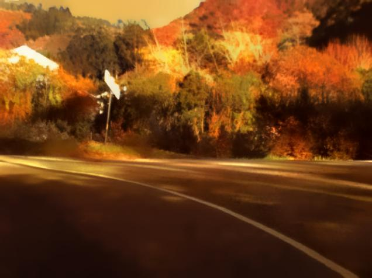
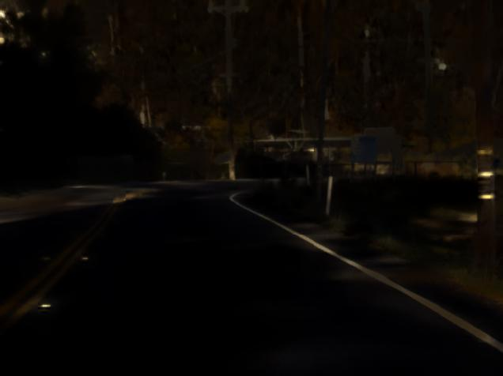
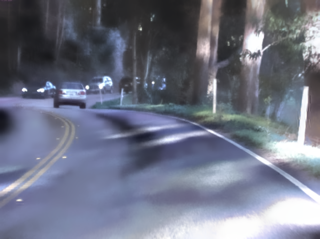
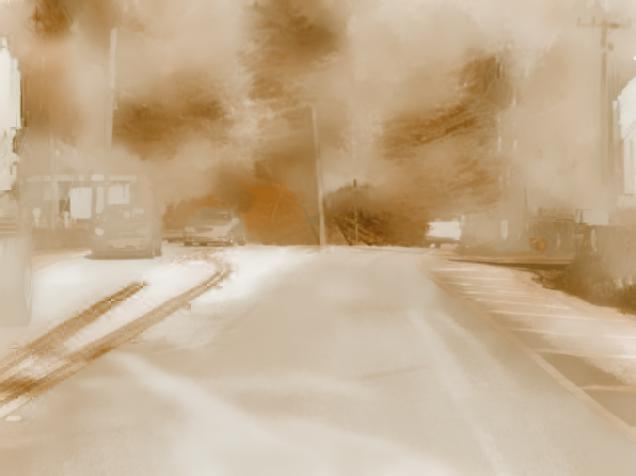
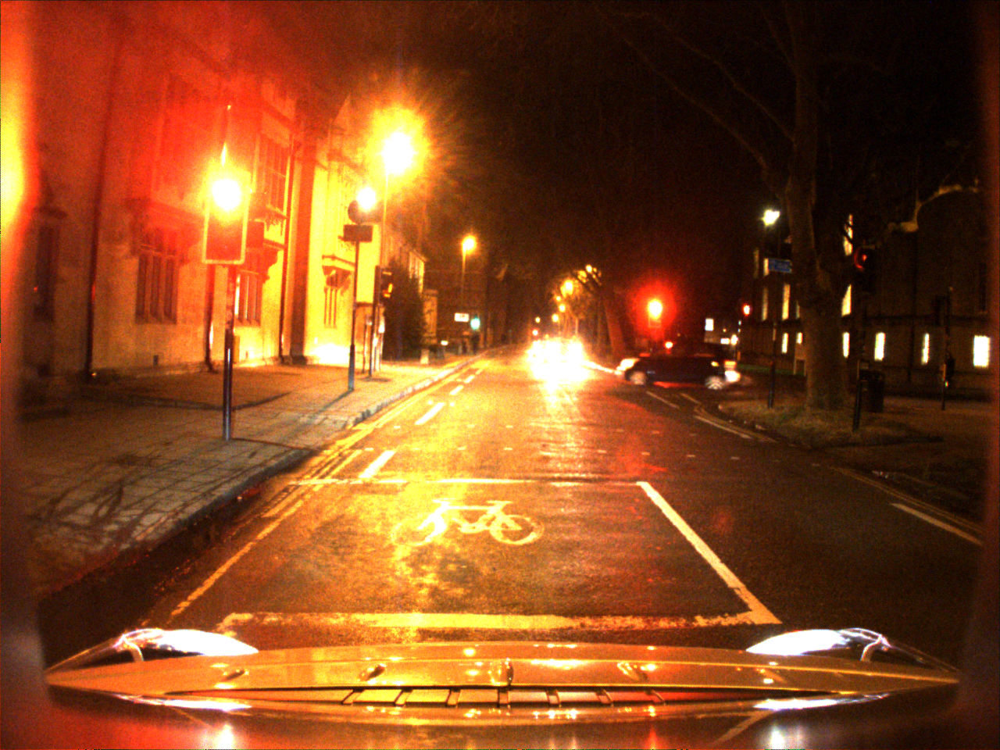

I've tried Nvidia's FastPhotoStyle in the last week, along with the training of CycleGAN using udacity day and Oxford robocar night dataset.

The FastPhotoStyle yields following results:

​			

Whose style images are respectively night(Oxford, with sufficient yellow street light), night(Oxford with little light), rain(Oxford rain), sandstorm(Derived from Internet), the content image are all from udacity dataset. The first of them is a surprising good result since it gives a "normal" result like an autumn style, nevertheless the original style is just like this:    

However, it still needs proper style image to generate ideal images. And further conclusion may be drawn after more tests.